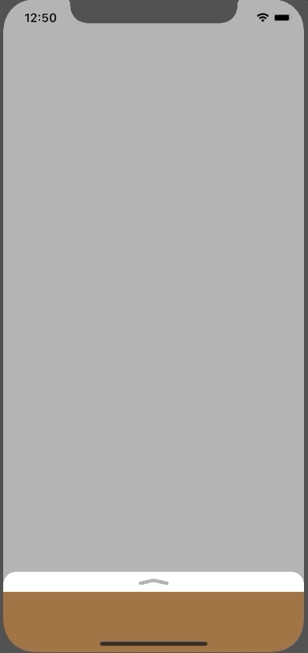

BottomSheet
===================
# Exaxmple



# Installation

## CocoaPods

Add next to your Podfile:
```
pod 'LKBottomSheet', '~> 1.1'
```

## Manually

To integrate BottomSheet manually into your project, copy files from `BottomSheetView` folder into your Xcode project.

# Contribution
Feel free for forking and making pull requests. Create issues if you need some specific feature.

# License

BottomSheet is released under the Apache-2.0 license. See [LICENSE](https://github.com/leshchenko/BottomSheet/blob/master/LICENSE) for details.
